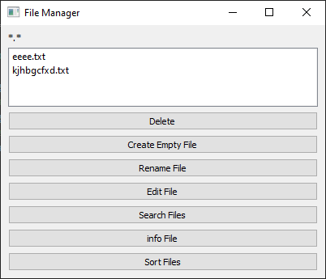

Используй и доработай следующий файл readme.md:

# Файловый менеджер

Программа "Файловый менеджер" предназначена для работы с файлами в директории. Она предоставляет пользователю удобный интерфейс для просмотра списка файлов, их удаления, создания, переименования, редактирования, поиска, отображения информации и сортировки.



## Используемые технологии

- Язык программирования: Python
- Графический интерфейс: PyQt5
- Модуль для работы с файлами: os
- Модуль для работы с датой и временем: datetime

## Возможности

1. Отображение списка файлов в директории.
2. Удаление выбранного файла из списка.
3. Создание пустого файла.
4. Переименование выбранного файла.
5. Редактирование содержимого выбранного файла.
6. Поиск файлов по заданной маске.
7. Отображение информации о выбранном файле.
8. Сортировка файлов по имени, расширению или времени модификации.

## Особенности реализации

1. Программа реализована в виде класса FileManagerUI, который наследуется от класса QMainWindow.
2. Файлы в директории отображаются в виджете QListWidget.
3. При удалении файла выводится диалоговое окно для подтверждения операции.
4. При редактировании файла используется стандартный текстовый редактор.
5. Для поиска файлов используется стандартное диалоговое окно для ввода маски.
6. Информация о файле содержит его имя, размер, тип и время модификации.
7. Сортировка файлов выполняется по выбранному критерию (имени, расширению или времени модификации).

## Тестирование

Программа протестирована на наличие ошибок при выполнении всех основных операций (удаление, создание, переименование и т.д.). Также проверена корректность обработки ситуаций, когда выбранного файла не существует или невозможно выполнить запрошенное действие.

## Каталог репозитория содержит файлы:
1. main.py - основной файл, в котором будет запускаться приложение.
2. file_manager_ui.py - файл, содержащий классы и методы для создания графического интерфейса с использованием PyQt5.
3. file_manager_functions.py - файл, содержащий функции для операций с файлами, такие как удаление, создание, переименование и редактирование.
4. tz.txt - файл с техническим заданием
5. каталог docs - с файлами которыми управляет программа

## Установка программы

Для установки программы на своем омпьютере выполнителе следующий код
```
git clone https://github.com/aizikov/folder-serv.git
```

## Запуск программы

Запуск программы по следующей команде.
```
python3 main.py
```


